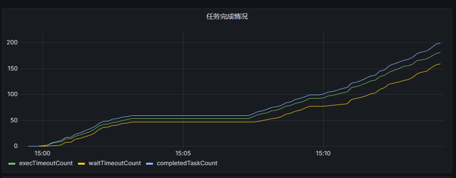
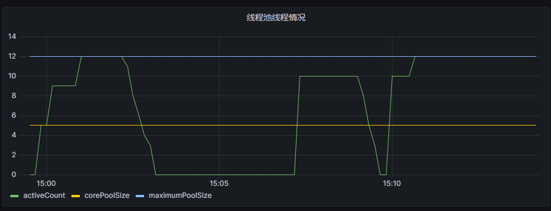
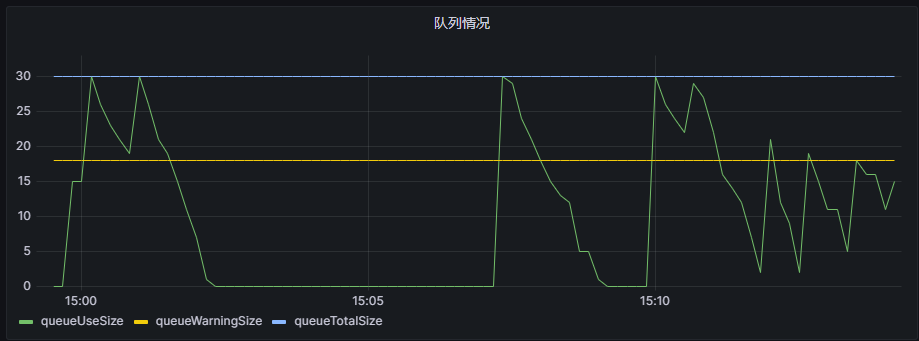
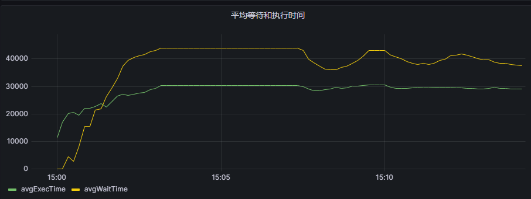

# 动态线程池
- 实时监测线程池的各项指标信息
- 通过配置中心（如nacos）可以动态设置线程池参数
## 与Grafana结合可以实现如下图效果 
 




## 实时监测线程池的状态
监测线程池的如下信息:    

| Field              | Type    | Description    |  
|--------------------|:--------|:---------------|
 | key                | String  | 线程池唯一标识        |  
 | name               | String  | 线程池名           |   
 | queueFullWarning   | Boolean | 队列是否长度超过阈值     | 
 | queueWarningRatio  | Double  | 任务队列使用比例阈值     | 
 | queueWarningSize   | Integer | 任务队列预警长度       |
 | queueUseSize       | Integer | 任务队列使用数量       |
 | queueCapacity      | Integer | 队列容量           |
 | waitTimeoutCount   | Long    | 任务等待时间超过阈值的数量  |
 | execTimeoutCount   | Long    | 任务z执行时间超过阈值的数量 |
 | totalExecTime      | Long    | 任务执行总时长        |
 | avgExecTime        | Integer | 任务平均执行总时长      |
 | completedTaskCount | Long    | 任务完成数量         |
 | activeCount        | Integer | 当前活跃的线程数       |
 | corePoolSize       | Integer | 核心线程数量         |
 | maximumPoolSize    | Long    | 任务完成数量         |
 | waitTimeout        | Long    | 等待超时时间，毫秒      |
 | execTimeout        | Long    | 执行超时时间，毫秒      |
 | createTime         | Long    | 时间，毫秒          |

## 动态设置线程池参数
通过nacos动态设置线程池参数，可设置的线程池参数如下：

| Field             | Type   | Description   |
|:------------------|:-------|:--------------|
| key               | String | 线程池唯一标识       |
| name              | String | 线程池名称         |
| queueWarningRatio | Double | 任务队列使用比例阈值    |
| queueCapacity     | int    | 队列容量          |
| waitTimeout       | long   | 任务等待时长阈值，单位毫秒 |
| execTimeout       | long   | 任务执行时间阈值，单位毫秒 |
| corePoolSize      | int    | 核心线程池数量       |
| maximumPoolSize   | int    | 最大线程池数量       |

## 使用方法
### 实现自己的消费日志的类
实现Consumer<ThreadPoolInfo>接口，参考EsThreadPoolInfoConsumer
### 实例化ThreadPoolExecutorManager,如下
```
  @Bean
    public ThreadPoolExecutorManager threadPoolExecutorMonitor(EsThreadPoolInfoConsumer esThreadPoolInfoConsumer){
        return new ThreadPoolExecutorManager(esThreadPoolInfoConsumer);
    }
```
### 创建线程池
```
  ExecutorService threadPoolExecutor = ThreadPoolExecutorPlus.builder()
            .corePoolSize(5)
            .maximumPoolSize(20)
            .key("test")
            .name("kafka")
            .queueWarningRatio(0.6d)
            .execTimeout(3000)
            .waitTimeout(5000)
            .keepAliveTime(30)
            .unit(TimeUnit.SECONDS)
            .workQueue(new LinkedBlockQueueDecorator<>(30))
            .build();
```
### <可选> 配置线程池参数
```
thread:
  pool:
    plus:
      config:
        - key: test
          name: kafka
          queue-warning-ratio: 0.6
          wait-timeout: 2000
          exec-timeout: 5000
          core-pool-size: 5
          maximum-pool-size: 12
          queue-capacity: 120
```
需要注意点：
 - queue-capacity参数仅当线程池队列的实现为LinkedBlockQueueDecorator时，才有效
 - key和线程池的key相互对应，唯一不可重复
 - 如果配置文件中有key对应的线程池的话，则实例化线程池的参数则会被配置文件中的替代

### 参考项目spring-thread-pool-test

